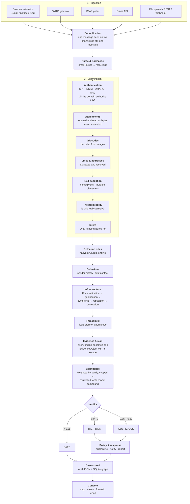
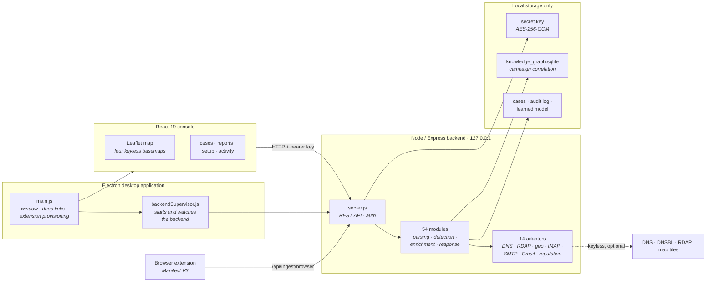

# PhishLens

A phishing detector that runs entirely on the machine that installed it.

No paid APIs, no subscriptions, no account, and no server belonging to anyone
else. Every message is examined locally, every result is stored locally, and
nothing is sent anywhere. The only network traffic PhishLens makes is to public,
keyless services — DNS, public blocklists, and map tiles — and it works without
those too, saying so plainly when it cannot reach them.

It does not look for suspicious wording. Anyone can write fluent, urgent,
convincing copy with a language model now, so vocabulary tells you almost
nothing. PhishLens looks at things an attacker has to do in order for the attack
to work: where the message actually came from, whether the sending domain really
authorised it, what is inside the attachments, and where a link actually leads.

---

## Contents

- [What it watches](#what-it-watches)
- [How a message is judged](#how-a-message-is-judged)
- [Architecture](#architecture)
- [Attachments](#attachments)
- [Detection rules](#detection-rules)
- [Optional tools](#optional-tools)
- [Setting up monitoring](#setting-up-monitoring)
- [Building from source](#building-from-source)
- [Testing](#testing)
- [Repository layout](#repository-layout)
- [Design commitments](#design-commitments)

---

## What it watches

PhishLens does not ask you to connect a mail account. Connecting an account
covers one account, sees a message no sooner than a poll allows, and asks for
credentials to do it. The useful question is not *which account did you add* but
*could a message reach you without being examined* — and that is a question
about channels.

| Channel | When it sees a message | What it needs |
|---|---|---|
| **Browser** | Before you open it | The PhishLens extension, loaded unpacked |
| **SMTP gateway** | Before it is delivered | Control of where your mail is routed |
| **IMAP poller** | Shortly after it arrives | Mailbox credentials or OAuth |
| **Gmail API** | Shortly after it arrives | A Google OAuth client you create |
| **File upload** | When you hand it over | Nothing |
| **REST API** | On submission | An API key |
| **Webhook** | On delivery | An API key |

Only the SMTP gateway sees a message before it reaches a mailbox at all.
Everything else sees it after the provider has it — and the best any of them can
do, which is still worth a great deal, is examine it **before a person opens
it**. The console states this per channel rather than implying they are
equivalent.

---

## How a message is judged

Analysis runs as a pipeline. Each stage adds findings; no stage decides the
verdict on its own.



### The scoring rule that matters

Findings are grouped into families — authentication, identity, attachment,
infrastructure, language, campaign — and each family is **capped**. Ten
correlated facts about one broken SPF record should not add up to ten times the
evidence.

The cap has one deliberate exception. A finding with **no innocent
interpretation** raises a case to high risk on its own, through a floor that
appears in the reasoning rather than as a silent override. An emailed sign-in
page that posts a password to a remote address is one of these: it scores 0.70
even when SPF, DKIM and DMARC all pass, because nothing is wrong with the
headers and the entire attack is inside the attachment.

---

## Architecture



Everything inside the box is on your machine. The dotted line is the only
traffic that leaves it, and all of it is to public services that need no
account.

---

## Attachments

Attachments used to be hashed and described and never opened, which is safe and
nearly useless: the file carrying the attack and the file carrying the invoice
have the same name, size and MIME type, and differ only inside.

They are now read as bytes — never executed, never rendered:

- **What the file actually is**, from its signature rather than its extension.
  A program named `invoice.pdf.exe` and declared as `application/pdf` is
  reported for each of those three things separately.
- **Office macros**, found by walking the container. A macro-bearing document is
  a ZIP holding `vbaProject.bin`, so this needs nothing installed.
- **Remote template references** — a document carrying no macros at all that
  fetches the rest of itself from a URL when opened.
- **PDF active content** — `/OpenAction`, `/JavaScript`, `/Launch`, embedded
  files, and the addresses the document links to.
- **Archive contents**, including executables inside, and decompression ratios.
- **Filename attacks** — right-to-left override characters, double extensions.

Where `oletools` is installed, macro code is also read and reported: what runs
it automatically, what capabilities it uses, whether it is obfuscated, and which
addresses it contains.

**If a document carries macros and nothing can read them, that is reported as a
finding.** It is never reported as clean.

---

## Detection rules

Twelve rules ship with PhishLens, written in YARA syntax and matched against
attachment bytes. They describe **structure**, not vocabulary — an attacker
writing copy with a language model changes the words and cannot change the fact
that a credential form has to post somewhere.

| Rule | What it describes |
|---|---|
| `HTML_Credential_Form_Posting_Offsite` | An emailed sign-in page that posts a password to a remote address |
| `HTML_Smuggling_Blob_Download` | A page that assembles a file in the browser so nothing on the wire can scan it |
| `HTML_Clipboard_Paste_To_Run` | A page that copies a command and asks you to paste it into the Run dialog |
| `HTML_Meta_Refresh_To_Encoded_Page` | A redirect into a document carried inside the page itself |
| `HTML_Obfuscated_Body_Only` | A page whose content is assembled from encoded text at runtime |
| `SVG_With_Embedded_Script` | An image the browser treats as a document and runs script inside |
| `LNK_Shortcut_Running_A_Shell` | A shortcut whose target is a command interpreter |
| `Encoded_PowerShell_Command` | A command line encoded so it cannot be read |
| `RTF_Loading_Remote_Object` | A document that fetches an object from the network on open |
| `Office_DDE_Auto_Execution` | A field that runs a program without any macro present |
| `Disk_Image_Attachment` | A container whose contents escape the downloaded-file warning |
| `Archive_Password_Hint_In_Message` | Encryption that protects the file from scanners, not from you |

**Why there is a built-in rule engine.** YARA is a C library. Installing its
Python binding here fell back to compiling from source, which needs a toolchain
nobody installing a phishing detector has a reason to own — so the rules run on
an engine that ships with PhishLens and implements a documented subset of YARA
syntax. Real YARA is preferred where it is installed. A rule using a construct
the built-in engine does not support is **refused by name**, never silently
skipped.

---

## Optional tools

All open source, all local, all free. **None are required** — every message is
analysed without them.

| Tool | Licence | What it adds | Without it |
|---|---|---|---|
| [oletools](https://github.com/decalage2/oletools) | BSD-2 | Reads the macro code inside Office attachments | Macro-bearing documents are still detected; the code is not read |
| [Wireshark / TShark](https://www.wireshark.org/) | GPL-2.0 | Whether this machine connected to a host an email pointed at | A dangerous link can be reported, but not whether anyone followed it |
| [YARA](https://virustotal.github.io/yara/) | BSD-3 | Widens what a rule may be written in | The shipped rules all run anyway |
| [ClamAV](https://www.clamav.net/) | GPL-2.0 | Known-malware signatures | Files already known to be malicious are not recognised by name |

Install one and PhishLens finds it — the console lists what is present and what
each absence costs. To install oletools:

```bash
pip install oletools
```

### A note on Wireshark

It **cannot read your mail**, and nothing here pretends otherwise. Every mail
path worth watching is TLS — webmail over HTTPS, IMAP on 993, SMTP on 465 or
587 — so a capture is ciphertext. Reading it would mean installing a certificate
authority and intercepting your own browser, which is an attack on the person
being protected.

What stays readable without breaking anything is the metadata: the server name
in a TLS ClientHello is sent before encryption begins, and DNS questions are
plain unless the resolver is DoH. That answers the one question the message
cannot: *this link was dangerous, and four minutes later this machine connected
to it.* That is the difference between a warning and a clicked link.

---

## Setting up monitoring

The browser extension is what examines mail actually arriving in your inbox. It
reads messages in Gmail or Outlook Web using the sign-in already in your
browser — no password, no app password, nothing stored anywhere.

PhishLens writes its own address and key into the extension folder when it
starts, so there is nothing to type.

1. **Open PhishLens** and go to **Where mail arrives** (or press **Set up
   monitoring** on the Overview).
2. **Copy the folder path** shown under *Folder to load*.
3. In Chrome or Edge, open **`chrome://extensions`** and turn on **Developer
   mode** (top right).
4. Click **Load unpacked**. In the file dialog, **paste the path into the
   dialog's address bar** and press Enter, then **Select Folder**.
5. **Open Gmail or Outlook Web.** New messages are examined as they appear in
   the list.

The console's **Where mail arrives** page shows each channel as `ACTIVE`,
`FAILED` or `DISABLED`. A channel only becomes active once traffic has actually
arrived from it — an extension that was installed but never ran is not reported
as working.

---

## Building from source

**Requirements:** Node 20+, npm. Windows for the installer; the backend and
console are cross-platform.

```bash
git clone https://github.com/mdyounus-git/PhishLens.git
cd PhishLens
```

```bash
cd phishlens-backend && npm install && npm start
```

```bash
cd phishlens-dashboard && npm install && npm run dev
```

To build the desktop installer:

```bash
cd phishlens-desktop && npm install && npm run build
```

Windows frequently keeps a lock on `dist/win-unpacked` after a build, which
electron-builder cannot remove. Build to a fresh directory instead:

```bash
npx electron-builder --config.directories.output=dist-1.7.1
```

The packaging tests follow the most recently written build, so they check the
artefact you actually made rather than a stale one.

---

## Testing

```bash
cd phishlens-backend && npm test
```

| Suite | Tests | What it covers |
|---|---|---|
| Backend | 302 | Detection pipeline, rules, attachments, IP classification, mail polling, hardening |
| Desktop | 28 | What the installer actually contains, checked against the built package |
| Console | 4 | Static checks over the source for faults a clean build does not catch |

The desktop suite exists because a build succeeding is not evidence that the
thing built works: the first packaged build exited 0, produced a 111 MB
installer, and shipped a backend with no `node_modules` at all. The console
suite exists for the same reason — two faults shipped through a clean build, an
installer and an install, and both were plainly visible in the source.

---

## Repository layout

```
phishlens-backend/     Node/Express API and all analysis
  modules/             54 modules: parsing, detection, enrichment, response
  adapters/            14 adapters: DNS, RDAP, geo, IMAP, SMTP, Gmail, reputation
  rules/               Detection rules in YARA syntax
  tests/               302 tests
phishlens-dashboard/   React 19 + Vite console
phishlens-desktop/     Electron application and installer
phishlens-extension/   Manifest V3 browser extension
```

---

## Design commitments

These are constraints, not preferences, and the code is written to hold them.

**Nothing is paid, ever.** No API keys, no tiers, no accounts. This has already
changed decisions: a basemap provider began watermarking tiles with *API KEY
REQUIRED* and was replaced with keyless sources.

**Nothing depends on anyone else's server.** All storage and all execution is on
the machine that installed PhishLens.

**A thing that was not checked is reported as not checked.** Never as clean.
"No macros found" and "nothing here can read macros" are opposite findings, and
blurring them teaches people to trust a silence that means nothing. The same
applies to blocklist lookups that were refused, mail channels that have gone
quiet, and packet captures that were not running.

**Detection describes structure, not vocabulary.** Attackers write their copy
with language models now. What they cannot change is that a credential form has
to post somewhere and a shortcut has to name a program.

**A finding says why it matters**, in terms of what was found rather than the
name of the tool that found it.

**Failures stay visible.** A panel that cannot render says so in place instead
of blanking the window, and reports itself to the console rather than being
swallowed.

---

## Licence

See `LICENSE`. Third-party tools retain their own licences, listed above.
